# 🚀 Kubernetes Day 1 – Exercise

The full step-by-step lab is available in:

📄 `day1/assignment.md`

---

## 📌 Summary

In this exercise, the following tasks were performed:

- Installed kubectl and Minikube in a GitHub Codespace  
- Started a Minikube cluster and verified it using:
  - `minikube status`
  - `kubectl get nodes`  
- Ran a single nginx pod using `kubectl run`, inspected it, and deleted it (observed that it stays deleted)  
- Created a Deployment YAML with 3 nginx replicas and applied it  
- Deleted one pod manually and observed Kubernetes automatically recreating it (self-healing)  
- Scaled the Deployment up to 5 replicas and back down to 3  
- Broke the image intentionally (`nginx:doesnotexist`) and debugged using `kubectl describe pod` Events  
- Created a ClusterIP Service, applied it, and accessed it using `curl` from inside the Minikube container  
- Verified that the Service continues working even after deleting its backing pods  
- Read and understood the `~/.kube/config` file  
- Committed all Kubernetes YAML files to the repository  

---

## 📸 Screenshots

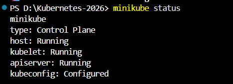

  

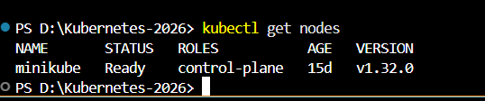

  

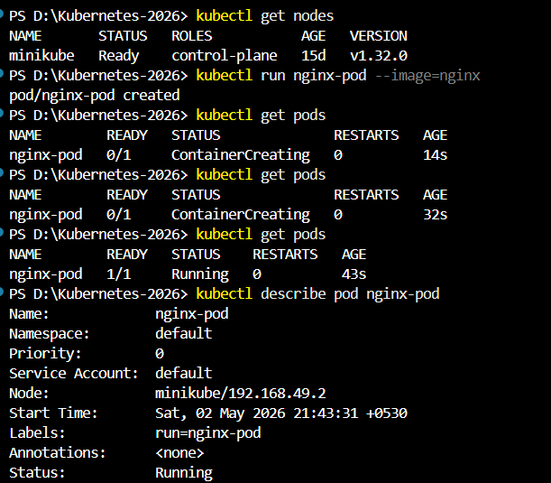

  

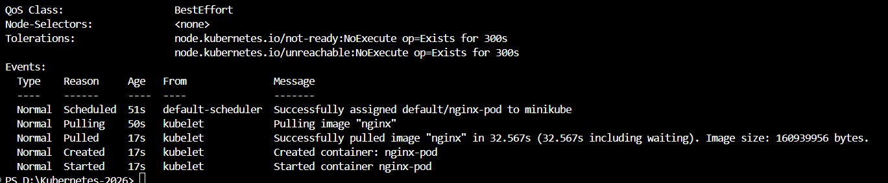

  

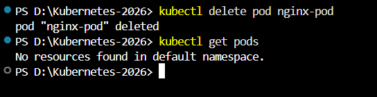

  

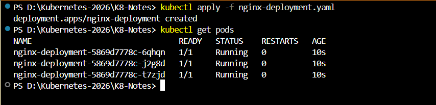

  

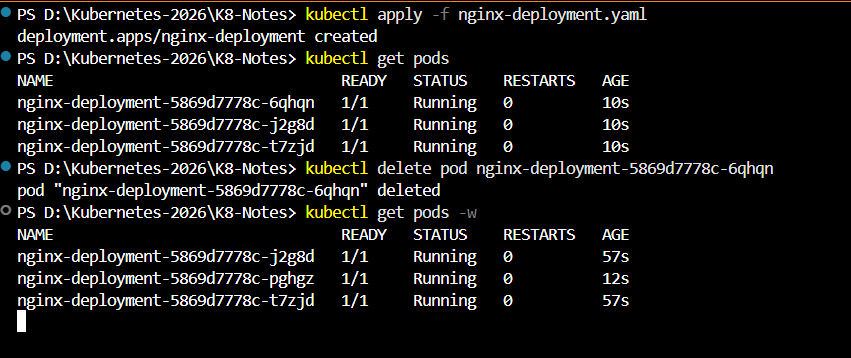

  

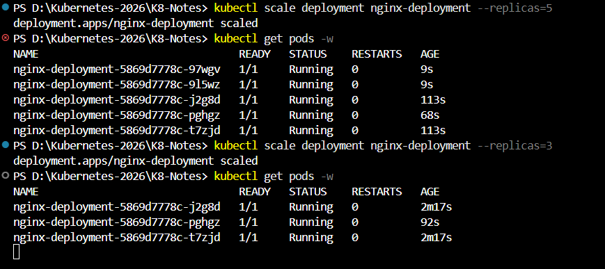

  

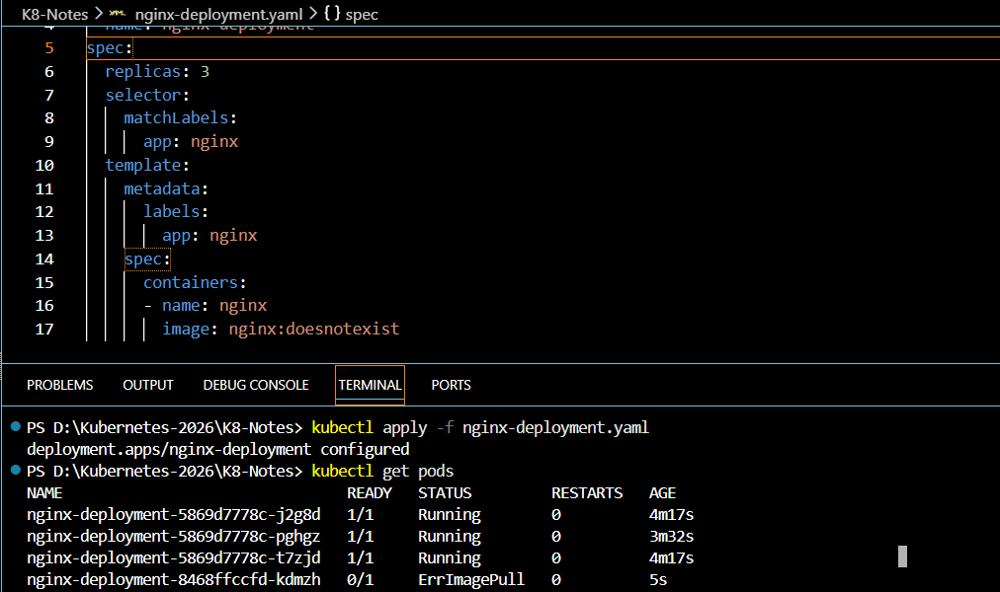

  

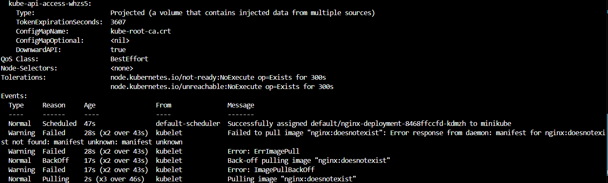

  

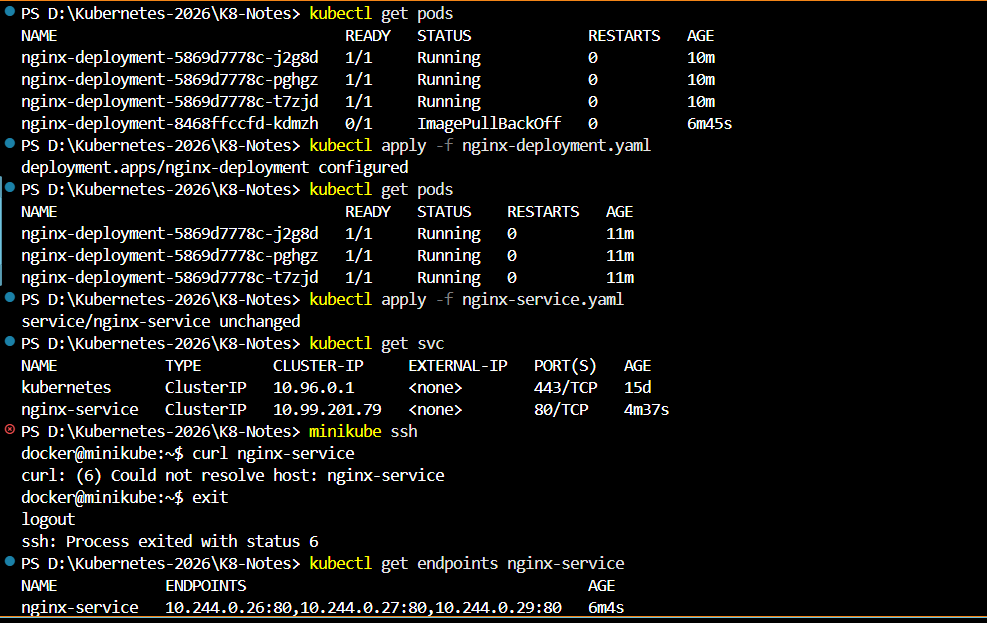

  

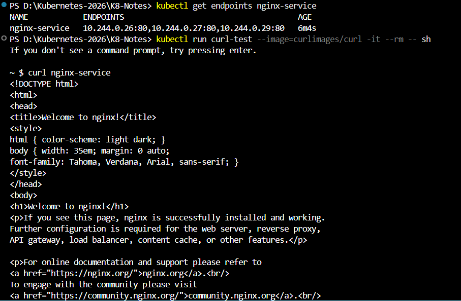

  

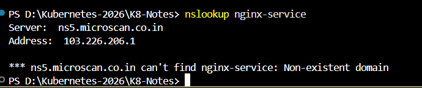

  

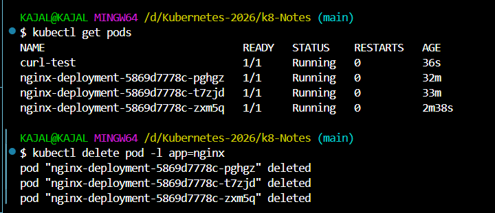

  

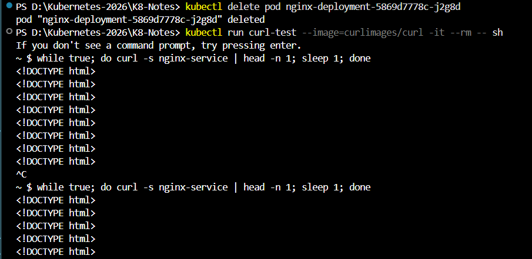 

---

## 📄 What is `~/.kube/config`?

It is a configuration file used by kubectl to:

- Connect to a Kubernetes cluster  
- Authenticate the user  
- Determine the current cluster context  

👉 Think of it as a connection profile  

**Definition:**  
The kubeconfig file stores cluster details, user credentials, and context mappings that allow kubectl to communicate with Kubernetes.

---

## 📦 Deliverables

- Screenshots of:
  - 3 pods running  
  - Self-healing in action  
  - Image pull error  
  - Service working via curl  
- `k8s/` folder containing all YAML files pushed to GitHub  